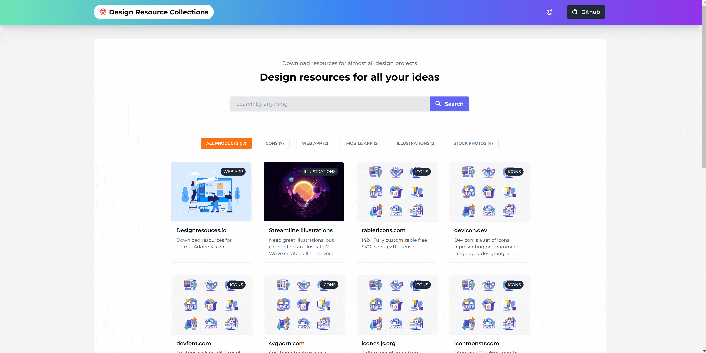

# Design Resource Collections 🎉 [Live](https://design-resource-collections.netlify.app/)

[](https://github.com/anburocky3/design-resource-collections)
[](https://github.com/anburocky3/design-resource-collections)
[](https://github.com/anburocky3/design-resource-collections)

[](https://discord.gg/6ktMR65YMy)
[](https://www.youtube.com/c/cyberdudenetworks)

A simple directory where you will find lots of freemium design resources like
icons, template ui, illustration, etc. Feel free to browse around.

## ⚙️ How it works?

[](https://design-resource-collections.netlify.app)

#### ✨ Visit this website: 👉 https://design-resource-collections.netlify.app 🎉

---

## 😎 Okay! How to Contribute?

1. [Fork this repository](https://github.com/anburocky3/design-resource-collections/fork)
2. Add your resource in `services/resources.json`. You can find the format
   below.

```jsonc
 {
    "id": 16, //increment accordingly
    "category": "Icons", // (Icons, Illustrations, Web App, Mobile App, Stock Photos)
    "title": "svgporn.com", // specify the clear title
    "description": "SVG logos for developers, designers, bloggers, geeks and more", // with description
    "link": "https://svgporn.com/", // share the website link
    "license": "Free" // specify is this fully free or freemium (Free + Buy as you go)
  },
```

3. Commit and push! 😊👍

### Author:

[Anbuselvan Rocky](https://bit.ly/AnbuselvanRockyFB)

### Contributors:

- No one, feel free to add your known resources. 😁

### License:

[MIT](./LICENSE)
